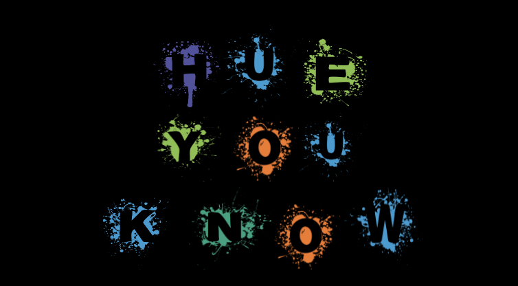
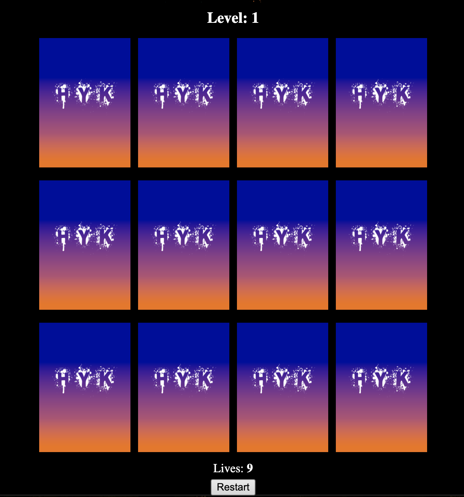
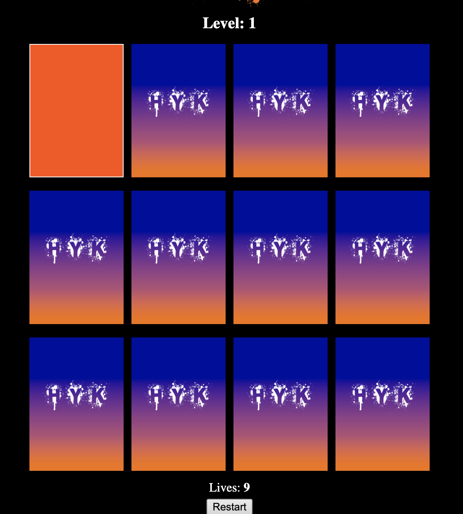
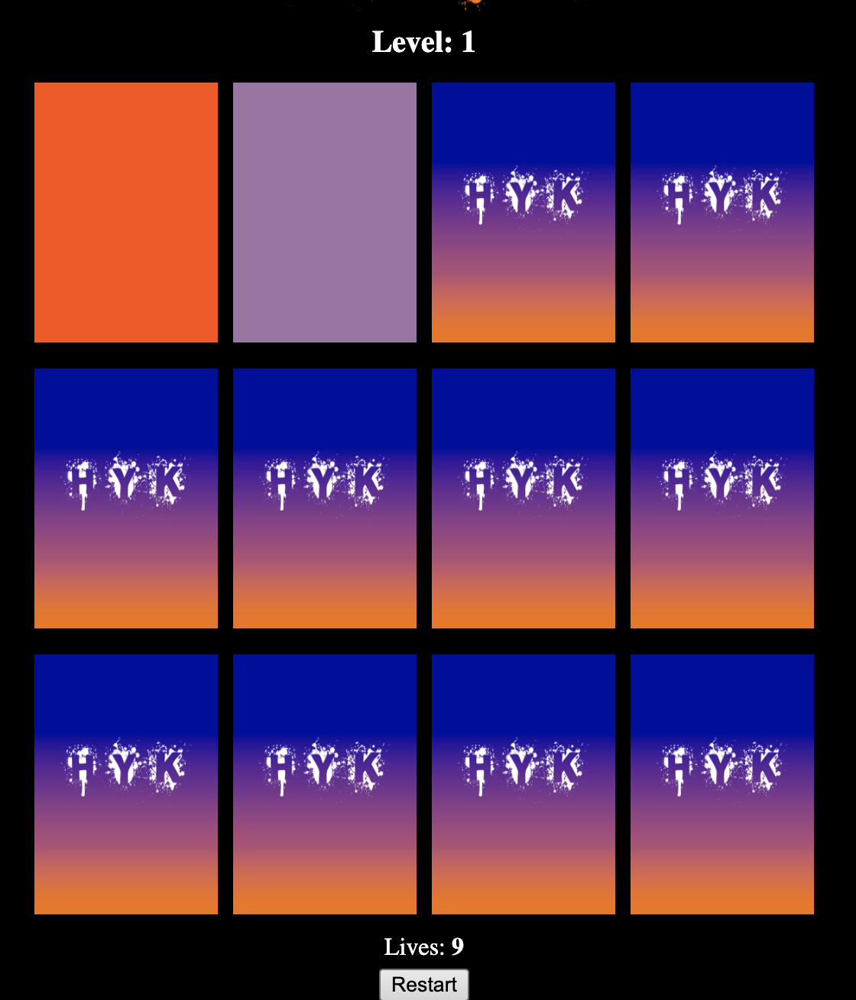
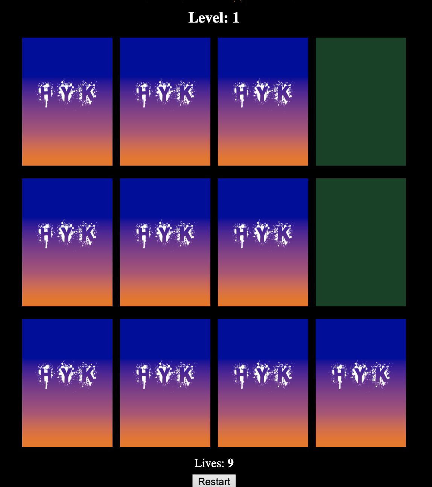
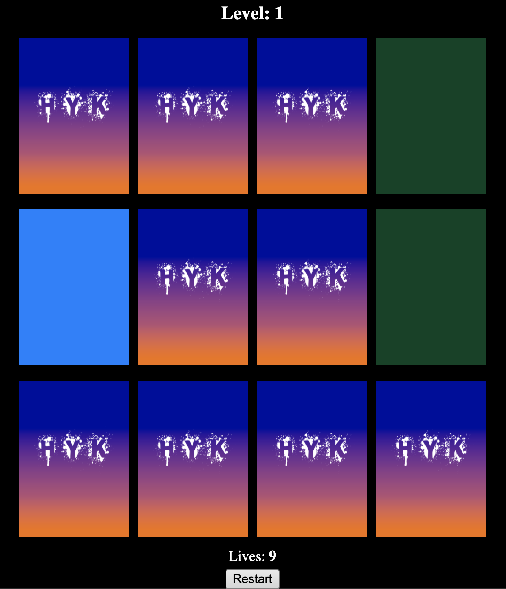
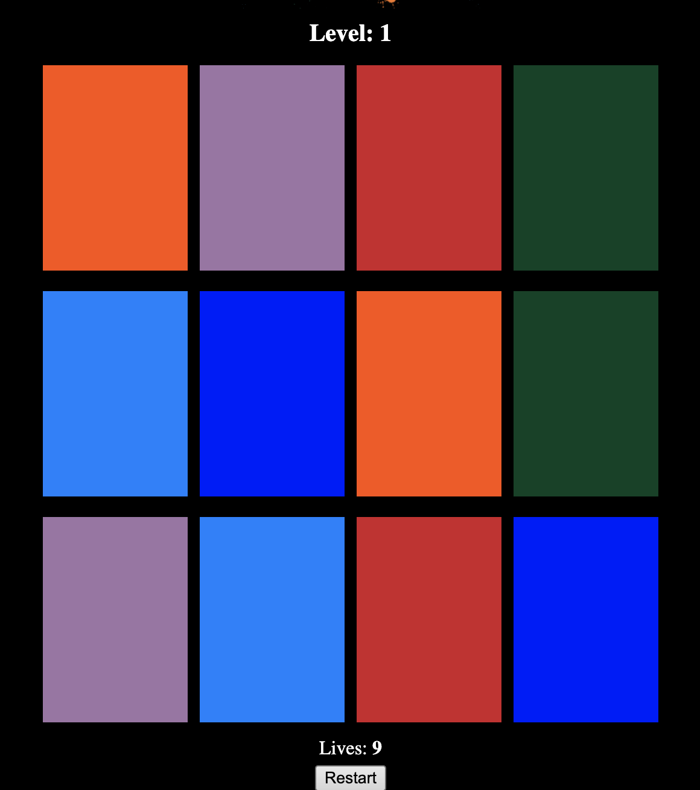
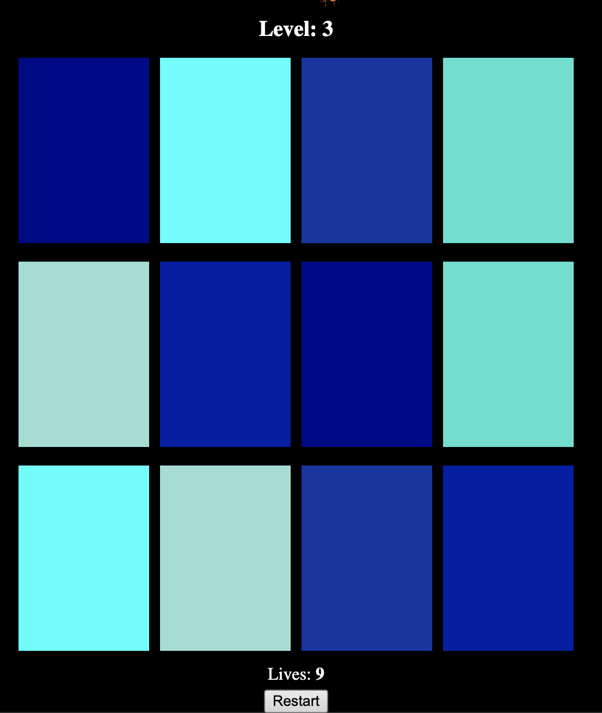
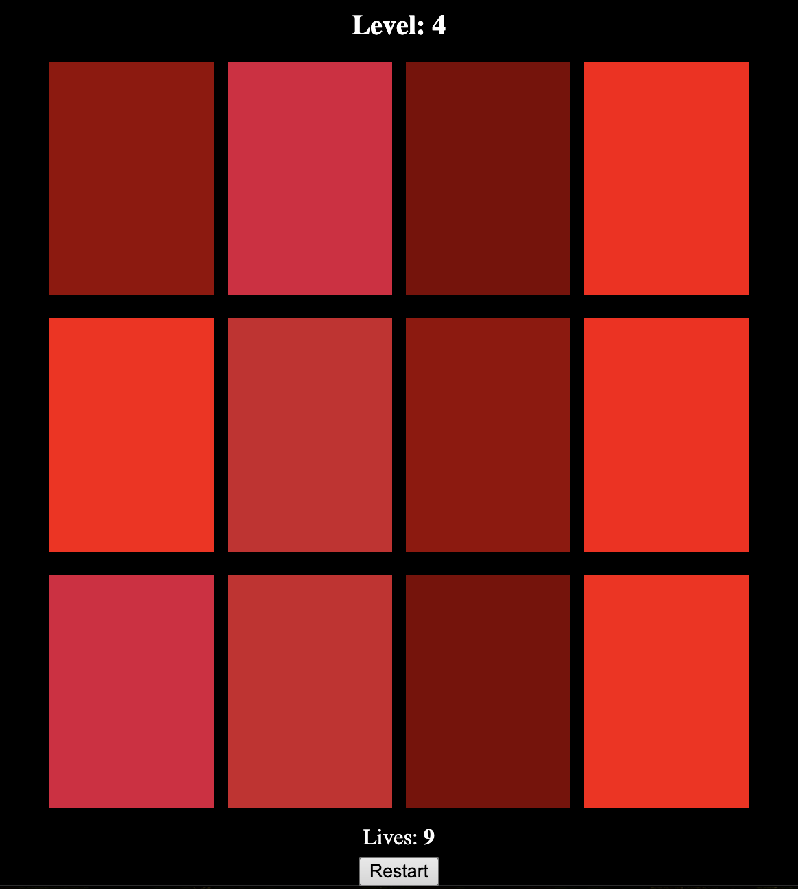
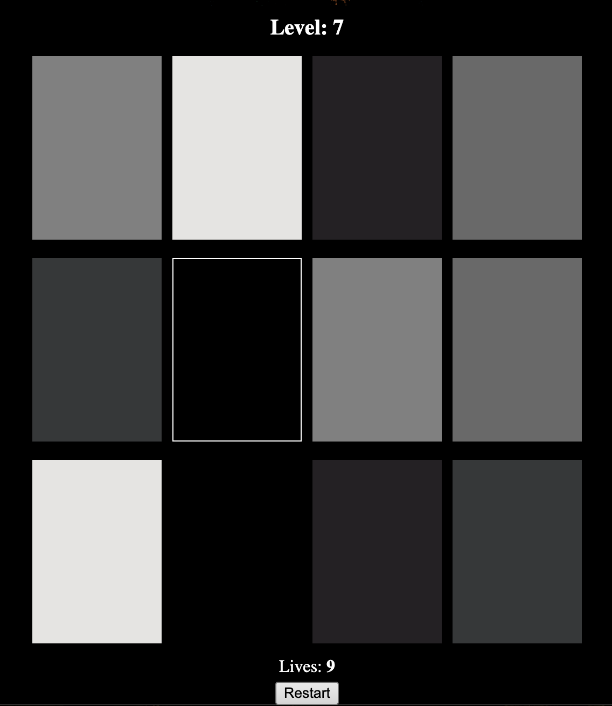

# Hue You Know

### About
Hue You know is a concentration match game. Concentration games test your memory as they're a
visual brain teaser. For further reading on memory games and its effect on brain health, 
please see the blogpost from Keck Medicine listed in the Sources Section. 
    
Typically, in concentration games, an even amount of cards are placed face down in a series 
of rows and columns. The user then flips two cards at a time in an attempt to match the first
flipped card with its exact pair. If the user is successful, the cards remain facing up and
points may be awarded. However, if the match is incorrect, the cards will be returned to its
face down position and the user must try again. This is continued until all cards are matched 
and facing up. 

In Hue You Know, the user will be matching colors. As the levels progress, the difficulty
intensifies as the colors become closer in hues. For example, Level 3 will be matching shades
of blue, Level 4 will be matching shades of red, etc. Level 7 being the most difficult as it 
has it features grayscale. In addition, unlike most concentration games, Hue You Know will only
allow the users 9 attempts before they must start over. Happy Matching! 

## Screenshots 

1. Hue You Know Title  

 

2. Hue You Know Level 1 Start Screen 

 

3. Hue You Know First Card Selection Example

 

4. Hue You Know Wrong Match Example 

 

5. Hue You Know Correct Match Example 

 

6. Hue You Know Second Attempt Example 

 

7. Hue You Know Completed Game Example 

 

## Technologies Used
 * Javascript, also known as ES6 or ECMAScript 2015
 * CSS3
 * HTML5

## Getting Started
Launch [Hue You Know](https://rachelramoutar.github.io/Hue-You-Know/) 

> [!NOTE]
> For added difficulty, the cards will disappear when they are incorrectly matched. 
They are still selectable, you will just have to use a little more brain power! 

## Next Steps (Future Features)

* Adding Different Levels 

    - Hue You Know - Level 3 Example (Blue) 

    

    - Hue You Know - Level 4 Example (Red)

    

    - Hue You Know - Level 5 Example (Grayscale)
    
    

* Adding a Splash Screen 

* Adding a Bubble effect with an event listener that changes the color of the bubbles once 
two cards are matched. 

 ## Sources
 1. https://www.w3schools.com/jsref/prop_node_textcontent.asp
 2. https://www.youtube.com/watch?v=bbb9dZotsOc 
 3. https://coolors.co/colors
 4. https://www.freecodecamp.org/news/generate-colors-in-javascript/
 5. https://telehealth.keckmedicine.org/blog/can-brain-games-improve-your-memory#:~:text=While%20some%20brain%20games%20claim,maintain%20or%20improve%20brain%20health
 6. Jason, the self-taught Software Engineer I met at Ash Coffee in Virginia Highlands, Atlanta, GA. 
